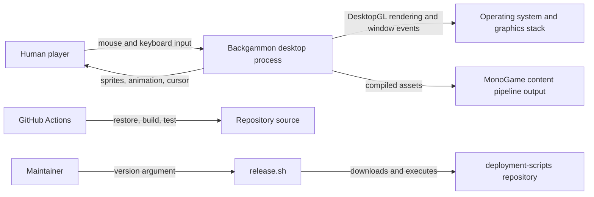
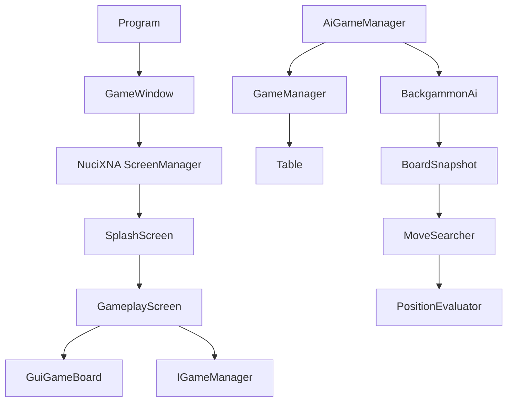
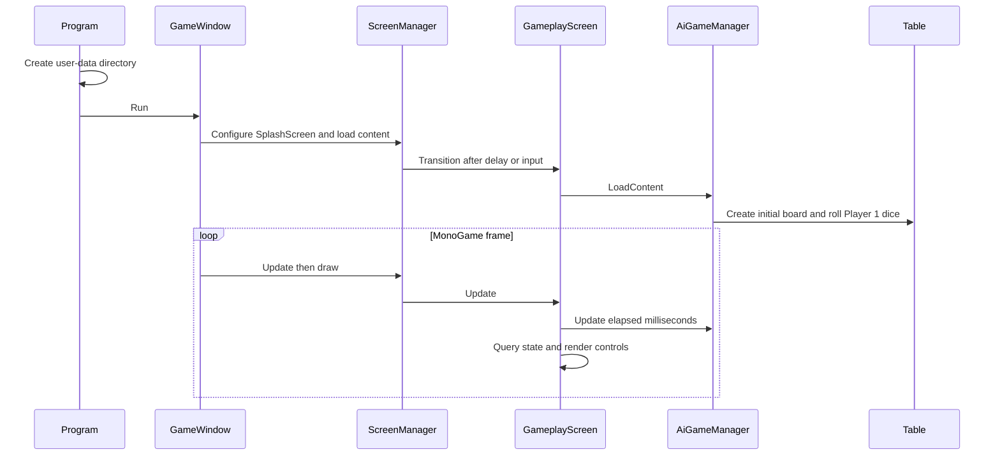
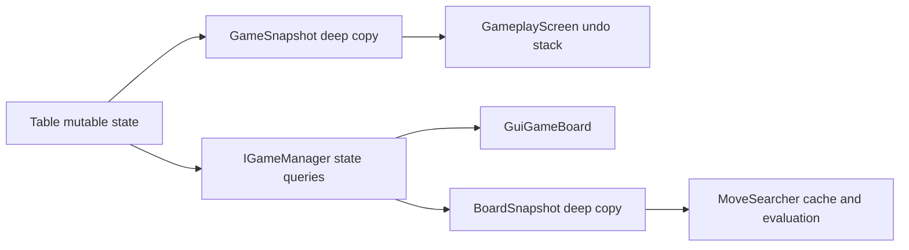
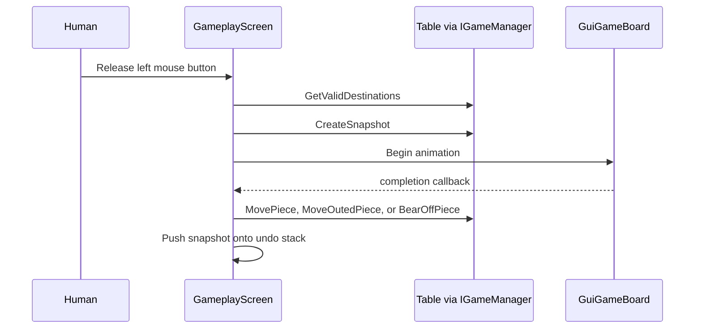
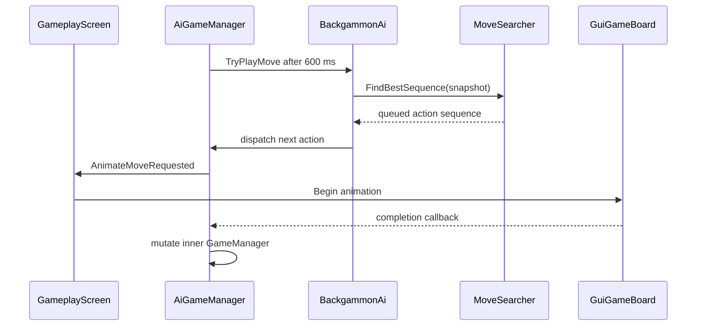
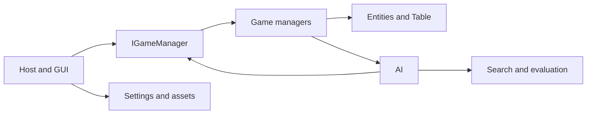

# Backgammon by Horatiu Architecture

This document records the verified current architecture of the desktop game, its runtime and state contracts, and the consequences of modifying them. It is intended for contributors and coding agents; it describes implementation evidence rather than a target design.

## 📑 Table of Contents

- [Purpose](#purpose)
- [System Context](#system-context)
- [Architectural Style](#architectural-style)
- [Runtime Flow](#runtime-flow)
- [Components](#components)
- [Architectural Areas](#architectural-areas)
- [Supporting Implementation Units](#supporting-implementation-units)
- [Data Architecture](#data-architecture)
- [Interfaces and Integrations](#interfaces-and-integrations)
- [Key Flows](#key-flows)
  - [Human Move and Undo](#human-move-and-undo)
  - [AI Turn](#ai-turn)
- [Domain-Specific Concerns](#domain-specific-concerns)
- [Cross-Cutting Concerns](#cross-cutting-concerns)
  - [Error Handling](#error-handling)
  - [Configuration](#configuration)
  - [Concurrency and Resource Use](#concurrency-and-resource-use)
- [Dependency Direction and Rules](#dependency-direction-and-rules)
- [External Dependencies](#external-dependencies)
- [Deployment and Operations](#deployment-and-operations)
- [Compatibility Contracts](#compatibility-contracts)
- [Testing and Verification](#testing-and-verification)
- [Design Constraints](#design-constraints)
- [Extension Points](#extension-points)
- [Architecture Decisions](#architecture-decisions)
- [Source Map](#source-map)
- [Related Documentation](#related-documentation)

## 🎯 Purpose

The application is a single-process, local two-player backgammon implementation: a human controls Player 1 (white, increasing column indices) and an in-process AI controls Player 2 (brown, decreasing indices). The system boundary comprises game rules, state, rendering, input, animation, assets, and the AI decision procedure. No network service, account system, external datastore, telemetry, or persisted match state is implemented.

## 🌐 System Context



The principal external boundaries are:
- **Human input and display:** MonoGame and NuciXNA mediate window, input, content, sprites, screens, and animations.
- **Content pipeline:** [`Content.mgcb`](BackgammonByHoratiu/Content/Content.mgcb) defines the compiled textures and fonts consumed at runtime.
- **Local file system:** [`Program`](BackgammonByHoratiu/Program.cs) creates a per-user application-data directory; no application code reads or writes the declared settings path.
- **Build and release infrastructure:** [`.github/workflows/dotnet.yml`](.github/workflows/dotnet.yml) is the verification path; [`release.sh`](release.sh) is a maintainer entry point that retrieves an external script.

## 🏗️ Architectural Style

The current implementation is a layered, single-threaded desktop game with an event-driven presentation layer. `GameplayScreen` coordinates NuciXNA input events and rendering controls; `IGameManager` is the presentation-to-rules contract; `GameManager` owns mutable rule state through `Table`; `AiGameManager` decorates that manager with a timed AI dispatcher and animation handshake. The AI builds an independent immutable search model from this contract.



The principal architecture boundaries are:
- **Presentation:** [`Gui`](BackgammonByHoratiu/Gui) converts user intent and rule-query results into controls, animation, and sprites.
- **Rules:** [`Entities/Table.cs`](BackgammonByHoratiu/Entities/Table.cs) is the authoritative mutable rules engine and game-state owner.
- **AI:** [`GameLogic/AI`](BackgammonByHoratiu/GameLogic/AI) models only the AI's current turn, searches possible action sequences, and evaluates terminal snapshots.
- **Settings and assets:** [`Settings`](BackgammonByHoratiu/Settings) defines static values and currently unused setting models; [`Content`](BackgammonByHoratiu/Content) supplies the compiled visual contract.

## 🔄 Runtime Flow



The principal runtime sequence is:
1. [`Program.Main`](BackgammonByHoratiu/Program.cs) creates `ApplicationPaths.UserDataDirectory`, starts, then disposes one `GameWindow`.
2. [`GameWindow`](BackgammonByHoratiu/GameWindow.cs) initialises MonoGame, NuciXNA global graphics/content/screen services, cursor assets, and the `SplashScreen`.
3. [`SplashScreen`](BackgammonByHoratiu/Gui/Screens/SplashScreen.cs) enters `GameplayScreen` after two seconds or any key or mouse press.
4. [`GameplayScreen`](BackgammonByHoratiu/Gui/Screens/GameplayScreen.cs) owns a game-manager instance, a board renderer, undo snapshots, selection state, and input event subscriptions.

## 🧩 Components

| Component | Responsibility | Principal Dependencies | Lifetime or Ownership |
|-----------|----------------|------------------------|-----------------------|
| `Program` | Process start, user-data directory preparation, disposal | `GameWindow`, `ApplicationPaths` | One process invocation |
| `GameWindow` | MonoGame host, content loading, screen/cursor update and draw | MonoGame, NuciXNA | One game instance |
| `GameplayScreen` | Human interaction, undo, board animation orchestration | `IGameManager`, `GuiGameBoard` | Active game screen |
| `AiGameManager` | Rule-manager decorator, 600 ms AI cadence, animation gate | `GameManager`, `BackgammonAi` | Per gameplay screen |
| `GameManager` | Exposes rules through `IGameManager` | `Table` | Per game or reset |
| `Table` | Board, players, dice, move legality, turn and win lifecycle | entity models, `GameDefines` | Per game or reset |
| `BackgammonAi` | Plans and dispatches Player 2 actions | `IGameManager`, search types | Per AI manager |
| `MoveSearcher` | Finds highest-scoring full remaining AI sequence | snapshots, evaluator | Static, per call cache |
| `GuiGameBoard` | Generates board geometry, sprites, indications, animations | `IGameManager`, NuciXNA controls | Per gameplay screen |

## 🗂️ Architectural Areas

### Runtime Host and Presentation

Paths:
- [`Program.cs`](BackgammonByHoratiu/Program.cs)
- [`GameWindow.cs`](BackgammonByHoratiu/GameWindow.cs)
- [`Gui`](BackgammonByHoratiu/Gui)

Responsibilities:
- Initialise framework globals and render each frame.
- Convert input into legal-move queries and rule-manager commands.
- Defer visible state mutation until corresponding animation callbacks.

Boundary rules:
- Presentation may query and command `IGameManager`; it does not directly mutate `Table`.
- UI coordinate sentinels for bars and houses are `GameDefines` values, not board indices.

### Game State and Rules

Paths:
- [`Entities`](BackgammonByHoratiu/Entities)
- [`GameLogic/GameManagers`](BackgammonByHoratiu/GameLogic/GameManagers)

Responsibilities:
- Maintain the signed 24-column board, player bar/completion state, available dice, active player, and undo snapshots.
- Enforce movement, hitting, bar entry, bearing off, doubles, turn completion, and automatic fresh-game state after a winner.

Boundary rules:
- `Table` is the authoritative state owner.
- `GameManager` delegates rather than duplicating rule logic.

### AI

Paths:
- [`GameLogic/AI`](BackgammonByHoratiu/GameLogic/AI)

Responsibilities:
- Create deep-copied Player 2 turn snapshots, enumerate legal single-die actions, maximise terminal evaluation, and dispatch the selected actions.

Boundary rules:
- Search state is isolated from the live table.
- AI owns no persistent cache beyond one `FindBestSequence` invocation.

## 🧱 Supporting Implementation Units

| Unit | Role and Dependency Contract |
|------|------------------------------|
| [`DicePair.cs`](BackgammonByHoratiu/Entities/DicePair.cs), [`DiceTriple.cs`](BackgammonByHoratiu/Entities/DiceTriple.cs), [`DiceQuadruple.cs`](BackgammonByHoratiu/Entities/DiceQuadruple.cs) | Value carriers for ordered composed-dice routes; `IsValid` uses a first-die sentinel of `-1`. They are private rule-engine helpers. |
| [`GameSnapshot.cs`](BackgammonByHoratiu/Entities/GameSnapshot.cs) | Deep-copy undo boundary for every table and player datum. |
| [`GamePhase.cs`](BackgammonByHoratiu/GameLogic/AI/Evaluation/GamePhase.cs) | `Racing`, `Blocking`, and `BackGame` evaluator dispatch values. |
| [`MoveAction.cs`](BackgammonByHoratiu/GameLogic/AI/Search/MoveAction.cs), [`MoveActionType.cs`](BackgammonByHoratiu/GameLogic/AI/Search/MoveActionType.cs), [`MoveSequenceResult.cs`](BackgammonByHoratiu/GameLogic/AI/Search/MoveSequenceResult.cs) | AI search action representation and scored sequence result; action types map to live manager commands. |
| [`MoveKey.cs`](BackgammonByHoratiu/GameLogic/AI/Search/MoveKey.cs) | Deduplicates source-column/die action generation within a snapshot. |
| [`IGameLogicManager.cs`](BackgammonByHoratiu/GameLogic/GameManagers/IGameLogicManager.cs), [`IGameManager.cs`](BackgammonByHoratiu/GameLogic/GameManagers/IGameManager.cs) | Lifecycle and complete presentation/AI-to-rules contracts implemented by both manager classes. |
| [`GuiButton.cs`](BackgammonByHoratiu/Gui/Controls/GuiButton.cs), [`InGameButtonIcon.cs`](BackgammonByHoratiu/Gui/Controls/InGameButtonIcon.cs) | Sprite-sheet backed undo/reset control and its row selection enum. |
| [`GuiGameBoard.cs`](BackgammonByHoratiu/Gui/Controls/GuiGameBoard.cs) | Board geometry, visual legal-move feedback, stacked-piece rendering, hit animation, and animation completion coordination. |
| [`FramerateCounter.cs`](BackgammonByHoratiu/Gui/Helpers/FramerateCounter.cs) | Thread-safe singleton rolling frames-per-second utility; no production caller currently exists. |
| [`CursorType.cs`](BackgammonByHoratiu/Settings/CursorType.cs) | Cursor content-map keys selected by `GameplayScreen` and rendered by `GameWindow`. |

## 💾 Data Architecture

All match data is memory-resident. A signed entry in `TableValues[0..23]` represents a column: positive values belong to Player 1; negative values belong to Player 2; magnitude is piece count. Bars and houses are held in `Player` counters rather than board entries. Dice values and the remaining usable dice are held separately. `GameSnapshot` deep-copies all mutable match state for undo.



| Data or Store | Owner | Representation and Storage | Lifecycle or Consistency |
|---------------|-------|----------------------------|--------------------------|
| Board columns | `Table` | `int[24]`, sign indicates player | Mutated only by `Table`; reset on new game or automatic game-over reset |
| Player state | `Table` | `OutedPieces`, `CompletedPieces`, `MovesLeft` | Mutated with each legal step; remaining dice gates turn transition |
| Undo state | `GameplayScreen` | `Stack<GameSnapshot>` | One snapshot per completed animated human move; cleared on reset, dice click, or turn progression |
| AI search state | `BoardSnapshot` | cloned columns, bar counts, Player 2 dice | Immutable-by-copy branch state; discarded after planning |
| Settings path | `ApplicationPaths` | user-local `Settings.xml` path | Declared only; no persistence implementation |

## 🔌 Interfaces and Integrations

| Interface or Integration | Direction | Contract | Owner | Failure Semantics |
|--------------------------|-----------|----------|-------|-------------------|
| `IGameManager` | Presentation to rules | Queries and commands for state, moves, dice, snapshots | `GameManager` and `AiGameManager` | Invalid commands throw `PieceMoveException` |
| `AnimateMoveRequested` | AI manager to screen | `(from, to, player, completion)` event | `AiGameManager` / `GameplayScreen` | AI remains waiting until subscriber calls completion |
| NuciXNA input events | Framework to screen | mouse and keyboard callbacks | `GameplayScreen` | Invalid human moves are caught and sent to standard error |
| MonoGame content pipeline | Build to runtime | logical content names defined by MGCB | `GameWindow`, controls | Missing/corrupt content fails framework loading; no local recovery |

## 🔀 Key Flows

### Human Move and Undo



The screen rejects board targets absent from `GetValidDestinations`. A multi-die direct move is divided into intermediate animations; each rule step receives its own pre-step snapshot. Undo is enabled only when Player 1 is active and no animation is active. Pressing `N` or `F2`, or using reset, creates a fresh game and clears undo history.

### AI Turn



Only Player 2 activates the timer. `AiGameManager` blocks further dispatch while its callback is pending or while `GuiGameBoard.IsAnimating` is true. If live dispatch throws `PieceMoveException`, `BackgammonAi` discards the remaining plan; it silently ignores a rejected `NextTurn` attempt.

## ⚙️ Domain-Specific Concerns

The authoritative backgammon rule and representation contract is documented in [docs/DOMAIN-RULES.md](docs/DOMAIN-RULES.md). The AI’s exact search and score model is documented in [docs/AI-DESIGN.md](docs/AI-DESIGN.md). These documents also identify semantic differences between live rule composition and AI search actions.

## 🧵 Cross-Cutting Concerns

### Error Handling

`Table` uses `PieceMoveException` to reject illegal moves, blocked destinations, wrong-player actions, premature turn changes, and invalid bearing off. `GameplayScreen` catches these exceptions around delayed state mutation and writes a prefixed message to standard error. `BackgammonAi` treats them as plan invalidation. Other loading and framework failures propagate; no structured logging, retry, or user-facing error UI exists.

### Configuration

| Configuration Area | Source | Responsibility | Override or Secret Policy |
|--------------------|--------|----------------|---------------------------|
| Board geometry and animation | [`GameDefines.cs`](BackgammonByHoratiu/Settings/GameDefines.cs) | fixed window, sentinels, sprite sizes, movement speed | compile-time values; no override |
| Audio setting model | [`AudioSettings.cs`](BackgammonByHoratiu/Settings/AudioSettings.cs) | default sound-enabled value | currently unused and not persisted |
| Graphics setting model | [`GraphicsSettings.cs`](BackgammonByHoratiu/Settings/GraphicsSettings.cs) | full-screen-derived resolution | currently unused by `GameWindow` |
| User-data path | [`ApplicationPaths.cs`](BackgammonByHoratiu/Settings/ApplicationPaths.cs) | application-data directory and `Settings.xml` location | directory is created; file is not read or written |

### Concurrency and Resource Use

The gameplay loop, manager updates, animations, and AI search run synchronously on the MonoGame update path. `FramerateCounter` has a thread-safe singleton construction mechanism but is not referenced by the host. The AI’s recursive search has no depth/time budget other than the finite dice list and holds an unbounded dictionary for one planning operation. Animation completion is an asynchronous-in-time callback contract, but no worker thread is involved.

## 🧭 Dependency Direction and Rules



The principal dependency rules are:
- GUI depends on `IGameManager`, settings, and framework controls; it must not own alternative rule state.
- `GameManager` delegates all gameplay changes to `Table`.
- `AiGameManager` may decorate manager calls for animation but must preserve `IGameManager` semantics.
- Search types depend on the manager interface and AI evaluation only; they do not mutate live game state.
- `Table` depends on entities and constants, not GUI or AI.

## 📦 External Dependencies

| Dependency | Responsibility | Integration Boundary | Architectural Consequence |
|------------|----------------|----------------------|---------------------------|
| MonoGame DesktopGL 3.8.4 | desktop window, game loop, graphics, content build | `GameWindow`, MGCB project integration | Runtime and asset pipeline require DesktopGL-compatible environment |
| NuciXNA libraries | content, geometry, input, GUI/screen and sprite abstractions | host and GUI | Global singleton services define lifecycle and rendering conventions |
| NUnit, test SDK, Moq | unit test execution and manager substitution | test project | Tests can construct internal AI state through `InternalsVisibleTo` |

## 🚀 Deployment and Operations

The product is one local graphical executable, with no service topology or durable game state. The desktop entry is described by [`BackgammonByHoratiu.desktop`](BackgammonByHoratiu.desktop). GitHub Actions restores packages, installs MGCB and fonts, builds, then tests on Ubuntu. The release script does not package locally by itself: it downloads the referenced upstream shell script and passes its arguments to it.

| Concern | Current Design | Architectural Consequence |
|---------|----------------|---------------------------|
| Process topology | One desktop process | No inter-process coordination or scaling model |
| Match persistence | None | Closing or resetting loses every match state and undo history |
| Asset availability | Compiled via MGCB | Build environments require the content-builder tool and available fonts |
| Release | External deployment script | Maintainer must inspect upstream script before execution |

## 🛡️ Compatibility Contracts

| Contract | Owner | Invariant | Verification | Change Policy |
|----------|-------|-----------|--------------|---------------|
| Signed board convention | `Table`, renderer, AI | Player 1 is positive/increasing; Player 2 is negative/decreasing | entity and AI tests; manual rendering check | Change atomically across rules, renderer, AI, and tests |
| 24-column geometry | `GameDefines`, `BoardLayout`, assets | Board indices are `0..23`; bar/house are sentinels | table and manager tests | Do not substitute sentinels for indices |
| `IGameManager` | game managers and GUI | command/query semantics used by screen and AI | manager tests; compile-time interface conformance | Preserve or update every caller together |
| Animation callback | `AiGameManager`, `GameplayScreen` | completion mutates AI state exactly once after visual movement | manual verification only | Subscribers must invoke supplied callback once |
| MGCB content names | controls and `GameWindow` | logical asset paths correspond to built content | build and manual launch | Rename producer and consumers together |

## ✅ Testing and Verification

The NUnit project verifies entities, primary table mechanics, game-manager delegation, AI snapshot cloning/legal actions, search completion, pip metrics, phases, selected evaluator comparisons, and threat calculations. It does not test GUI input, actual rendering, animation callbacks, splash transition, cursor behaviour, AI manager timing, settings persistence, or asset availability. [docs/TEST-TRACEABILITY.md](docs/TEST-TRACEABILITY.md) maps each material behaviour to concrete test files and gaps.

Execute the principal automated verification with:

```bash
dotnet test
```

For a full build-path check consistent with CI:

```bash
dotnet restore && dotnet build --no-restore && dotnet test --no-build --verbosity normal
```

## ⚠️ Design Constraints

- **No persistence:** The application creates a user-data directory but does not save settings or matches.
- **Immediate new game on victory:** When a player reaches 15 completed pieces, `Table.GameOver` resets the board instead of exposing a winner state.
- **AI scope:** Search maximises the remaining Player 2 turn only; it does not model an opponent response or dice probabilities.
- **Search budget:** Recursive search and its transient cache have no explicit time or memory limit.
- **UI coupling:** Screen animation sequencing depends on delayed callbacks and coordinate sentinels.
- **Random source:** `ThrowDice` creates a new `Random` instance for each roll; dice cannot be injected deterministically through the production API.

## 🔧 Extension Points

### Alternative Game Manager

1. Implement `IGameManager` and `IGameLogicManager` with all state, move, snapshot, and lifecycle semantics.
2. Construct it in `GameplayScreen.DoLoadContent` in place of `AiGameManager`.
3. Verify movement, undo, and animation interactions manually and with manager-level tests.

The replacement must honour the signed-board, active-player, sentinel, and delayed-animation contracts expected by `GameplayScreen` and `GuiGameBoard`.

### AI Evaluation Policy

1. Adjust or add phase/evaluation logic under [`GameLogic/AI/Evaluation`](BackgammonByHoratiu/GameLogic/AI/Evaluation).
2. Preserve snapshot immutability and higher-score-is-better semantics.
3. Extend targeted evaluator/search tests.

## 📝 Architecture Decisions

| Decision | Rationale | Consequence | Record |
|----------|-----------|-------------|--------|
| Signed integer board | One compact array stores ownership and stack count | Every rules, AI, and rendering consumer interprets sign | Documented here |
| Manager decoration for AI | The same rule interface serves human and AI paths | Animation logic intercepts Player 2 mutations | Documented here |
| Snapshot-based undo/search | Mutable table is isolated by deep copies | Undo and search avoid shared-state mutation | Documented here |
| Sprite/content pipeline | MonoGame assets are compiled instead of loaded by raw paths | Content names and MGCB entries are compatibility-sensitive | Documented here |

## 🗺️ Source Map

| Area | Path |
|------|------|
| Application host | [`BackgammonByHoratiu`](BackgammonByHoratiu) |
| State and rules | [`BackgammonByHoratiu/Entities`](BackgammonByHoratiu/Entities) |
| Manager boundary | [`BackgammonByHoratiu/GameLogic/GameManagers`](BackgammonByHoratiu/GameLogic/GameManagers) |
| AI search and evaluation | [`BackgammonByHoratiu/GameLogic/AI`](BackgammonByHoratiu/GameLogic/AI) |
| GUI controls and screens | [`BackgammonByHoratiu/Gui`](BackgammonByHoratiu/Gui) |
| Constants and models | [`BackgammonByHoratiu/Settings`](BackgammonByHoratiu/Settings) |
| Content manifest and assets | [`BackgammonByHoratiu/Content`](BackgammonByHoratiu/Content) |
| Unit tests | [`BackgammonByHoratiu.UnitTests`](BackgammonByHoratiu.UnitTests) |
| Detailed documentation | [`docs`](docs) |

## 📚 Related Documentation

- [README.md](README.md) provides installation and gameplay orientation.
- [docs/DOMAIN-RULES.md](docs/DOMAIN-RULES.md) specifies live board state, rule order, and UI-to-rules mapping.
- [docs/AI-DESIGN.md](docs/AI-DESIGN.md) specifies the AI model, search, evaluator, and limitations.
- [docs/TEST-TRACEABILITY.md](docs/TEST-TRACEABILITY.md) provides behaviour-to-test and test-to-behaviour traceability.
