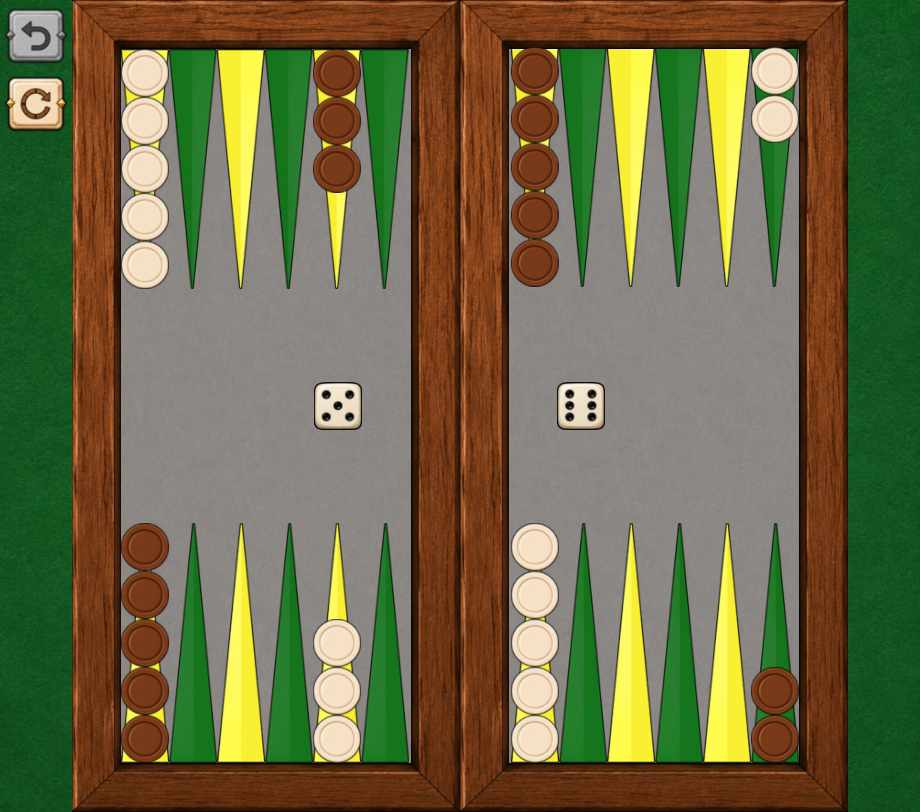

[](https://hmlendea.go.ro/funding)
[](https://github.com/hmlendea/backgammon-by-horatiu/releases/latest)
[](https://github.com/hmlendea/backgammon-by-horatiu/actions/workflows/dotnet.yml)
[](https://gnu.org/licenses/gpl-3.0)

# Backgammon, by Horațiu!

Open-source reimplementation of one of the oldest backgammon games for Windows!



## Features

## Gameplay

## Installation

### Flatpak

[](https://flathub.org/apps/details/io.github.hmlendea.BackgammonByHoratiu)

### Prebuilt releases

Download the latest packaged build from the [GitHub releases page](https://github.com/hmlendea/backgammon-by-horatiu/releases/latest).

## Running From Source

### Requirements

- .NET target framework: `net10.0`
- MonoGame DesktopGL (or compatible runtime)
- NuciXNA (restored automatically from NuGet)

The CI workflow installs `dotnet-mgcb` and TrueType core fonts before building on Ubuntu. If your local environment is missing MonoGame content build tooling or required fonts, install those before building.

### Build

```bash
dotnet build
```

### Run

```bash
dotnet run --project BackgammonByHoratiu
```

### Test

```bash
dotnet test
```

### Release

The repository includes `release.sh`, which delegates to the upstream deployment script used by the project maintainer.

```bash
bash ./release.sh 1.0.0
```

This script downloads and executes an external release helper from: `https://raw.githubusercontent.com/hmlendea/deployment-scripts/master/release/dotnet/10.0.sh`

**Note:** Piping into `bash` is an intensely controversial topic. Please review any external scripts before running them in your environment!

## Project Structure

## Contributing

Contributions are welcome.

Please:

- keep changes cross-platform
- keep pull requests focused and consistent with existing style
- update documentation when behaviour changes
- add or update tests for new behaviour

# Links
- [Latest release](https://github.com/hmlendea/backgammon-by-horatiu/releases/latest)
- [FlatHub release](https://flathub.org/apps/details/io.github.hmlendea.BackgammonByHoratiu)
- [FlatHub repository](https://github.com/flathub/io.github.hmlendea.BackgammonByHoratiu)

## License

Licensed under the GNU General Public License v3.0 or later.
See [LICENSE](./LICENSE) for details.